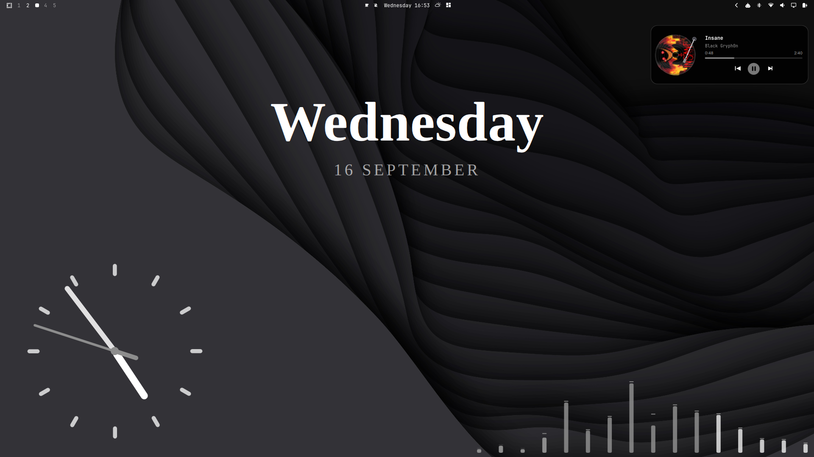

# Whimsy Widgets (`whimsy`)

[](https://omarchyplugins.com/plugin.html?id=whimsy)
[](LICENSE)

A playful collection of desktop widgets for [Omarchy Linux](https://omarchy.org): typographic clocks and date displays, analog/flip/cyber clocks, a day-progress ring, retro cassette and vinyl music players, audio visualizers, volume, real-time hardware telemetry pills/rings, and clean typographic weather displays — all placed as drag-to-desktop widgets.

Listed on the [Omarchy Plugin Marketplace](https://omarchyplugins.com/plugin.html?id=whimsy).

Pick a style from the bar pill popup, click to place a widget on the desktop, drag to move, drag the corner handles to resize or rotate, and it stays behind your windows.

---

## Preview



---

## Features

- 📅 **Typographic Date Styles**: Digital clean, editorial day, day number, italic weekday, ISO, week number, and more — rendered with configurable fonts, weights, sizes, colors, and spacing.
- 🕰️ **Clock Variants**: Slick minimal analog, flip clock, cyber HUD, and station clock — pick the look that fits your desktop.
- 📊 **Day Progress**: A circular progress ring showing how far the day has come.
- 🎵 **Retro Music Widgets**: Retro cassette player (vertical, tall aspect) and vinyl turntable — both tapping MPRIS for live title/artist/album/artwork, playback state, and seek.
- 📈 **Audio Visualizers**: 16-band spectrum bars with floating peak dots, LED rack equalizer (16×8 dot matrix), cyber pulse ring (360° radial), and oscilloscope waveform — all driven by a live `pw-record` → FFT pipeline.
- ⚡ **Hardware Telemetry**: Frosted glass pills (CPU, RAM, GPU, CPU+GPU combined Temps) and acrylic radial ring blocks (CPU, RAM, GPU) powered by real-time hardware telemetry daemon (`sys-monitor.py`).
- 🌤️ **Clean Typographic Weather Widgets**:
  - **Weather Capsule**: Compact frosted glass pill with live temperature, weather glyph, location, and wind speed.
  - **Weather Editorial**: Modern typographic card with prominent temperature typography, uppercase city headline, live condition glyph, and wind status.
  - **Weather Minimal Text**: Ultra-clean transparent horizontal text banner with live weather glyph and temperature.
- 🔊 **Volume Widget**: Quick volume readout tied to the active audio sink.
- 🔄 **Widget Rotation**: Drag the rotation handle at the bottom-left corner to spin any widget to any angle with automatic persistence.
- 🖱️ **Drag-to-Desktop**: Open the bar pill, pick a style, click — the widget is placed on the desktop and stays there across sessions (persisted in `~/.local/state/omarchy/whimsy/widgets.json`).
- ⚡ **Hot-Reloading**: Changes apply immediately without restarting your session.
- 🔒 **Widget Lock**: Placed widgets can be locked to prevent accidental moves or rotation.
- 🏷️ **Bar-to-Desktop Popout**: The bar pill doubles as an indicator and launches the style picker.

---

## Installation

Install directly through the Omarchy CLI:

```bash
omarchy plugin add https://github.com/rover-001/whimsy.git --enable
```

To enable it manually if not enabled automatically:

```bash
omarchy plugin enable whimsy
```

---

## Removal

To disable or remove the plugin from Omarchy:

```bash
# Disable the plugin
omarchy plugin disable whimsy

# Remove the plugin
omarchy plugin remove whimsy
```

---

## Usage

### Bar Pill

The bar widget shows the current day number in the bar. Click it to open the style picker popup.

### Style Picker

The popup groups styles into six categories:

- **Time** — digital clocks, analog clocks, flip clock, cyber HUD
- **Date** — editorial day, day number, italic weekday, day progress
- **Media** — retro cassette, vinyl turntable, volume
- **Visualizer** — spectrum bars, LED matrix, pulse ring, oscilloscope
- **System** — individual telemetry pills (CPU, RAM, GPU, CPU+GPU Temps) and ring pod blocks (CPU, RAM, GPU)
- **Weather** — weather capsule, weather editorial card, weather minimal text

Use the left/right arrows to cycle styles, preview them large in the center, and click to place the chosen widget on the desktop.

### Placed Widgets

Once placed, widgets:

- Sit on the bottom layer, behind normal windows, above the wallpaper
- Persist across sessions (positions, scale, rotation stored in `~/.local/state/omarchy/whimsy/widgets.json`)
- Can be dragged to reposition, resized with the bottom-right scale handle, rotated with the bottom-left rotate handle, and locked to prevent accidental moves
- Can be removed via the remove ✕ handle or right click

### Configuration

Configuration is stored in `~/.local/state/omarchy/whimsy/widgets.json` (auto-managed by the service). Widgets are added/removed/repositioned through the UI — no manual editing needed.

---

## Files

| Path | Purpose |
|------|---------|
| `manifest.json` | Plugin manifest: ID, name, version, entry points, bar widget metadata |
| `Model.js` | Widget/style definitions, categories, date formatting helpers |
| `Registry.js` | Engine-wide singleton bridge so bar instances and the popup reach the same service |
| `Service.qml` | Singleton host: owns `widgets.json`, materializes per-screen bottom-layer surfaces, IPC handler for place/remove/status |
| `Panel.qml` | Style picker popup (categories, preview, arrows, place action) |
| `BarWidget.qml` | Bar pill: shows day number, opens the popup on click |
| `DesktopWidget.qml` | Per-screen bottom-layer surface that hosts all placed widget cards |
| `DesktopCard.qml` | Individual placed widget card: style rendering, drag, resize, rotate, lock, remove |
| `AnalogClock.qml` | Slick minimal analog clock face |
| `FlipClock.qml` | Split-flap flip clock animation |
| `CyberClock.qml` | Cyber HUD-style radial clock |
| `DayFace.qml` | Text-based date/time renderer (used by most typographic styles) |
| `DayProgress.qml` | Circular day-progress ring |
| `MusicWidget.qml` | Retro cassette + vinyl music player (MPRIS-backed) |
| `VolumeWidget.qml` | Volume level readout |
| `VisualizerWidget.qml` | Audio visualizer container: bars, dots, wave, vumeter, radial variants |
| `visualizer-stream.py` | `pw-record` → FFT → 16-band normalized values pipeline (feeds VisualizerWidget) |
| `SysPillWidget.qml` | Individual glassmorphic pill widget: CPU, RAM, GPU, and CPU+GPU combined Temps |
| `SysRingBlockWidget.qml` | Individual glassmorphic ring block card with animated radial progress arcs |
| `SystemWidget.qml` | Hardware telemetry widget container (routes individual pills and ring blocks) |
| `sys-monitor.py` | Real-time CPU, RAM, and GPU telemetry daemon pipeline (feeds SystemWidget) |
| `WeatherPill.qml` | Weather widgets: capsule, editorial card, and minimal text banner |
| `music-info.sh` | MPRIS player resolver — prints TSV title/artist/playing/position/duration for MusicWidget |
| `fetch-art.py` | Secure artwork fetcher: DNS-rebinding-safe SSRF protection, monotonic deadline, 2 MB byte cap, Pillow fail-closed decode, and LRU cache |

---

## Requirements

- [Omarchy Linux](https://omarchy.org)
- Quickshell
- PipeWire (`pw-record` for the audio visualizer)
- Python 3 (`python3`)
- `python-pillow` (`pillow >= 10.0.0`) — runtime dependency for MPRIS artwork decode validation, dimension bounding, and decompression-bomb rejection

---

## Marketplace

- **Listing**: [https://omarchyplugins.com/plugin.html?id=whimsy](https://omarchyplugins.com/plugin.html?id=whimsy)
- **Submission Issue**: [#7180](https://github.com/omacom/omarchy-plugin-marketplace/issues/7180)

---

## License

This project is licensed under the [MIT License](LICENSE).
